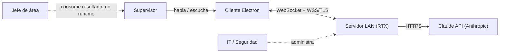
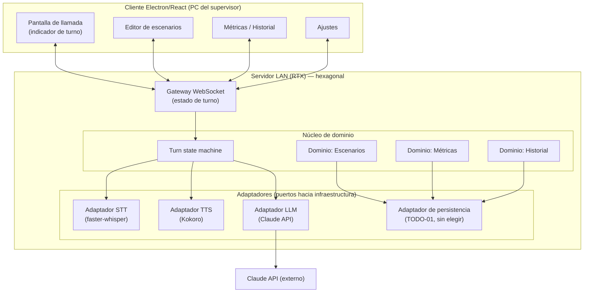
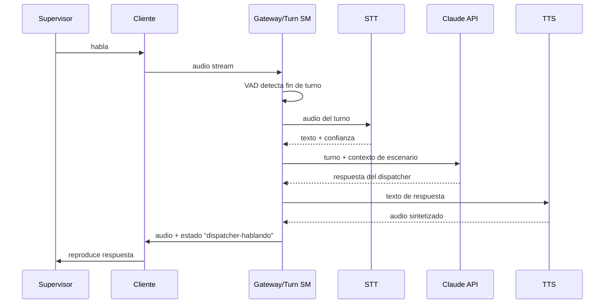
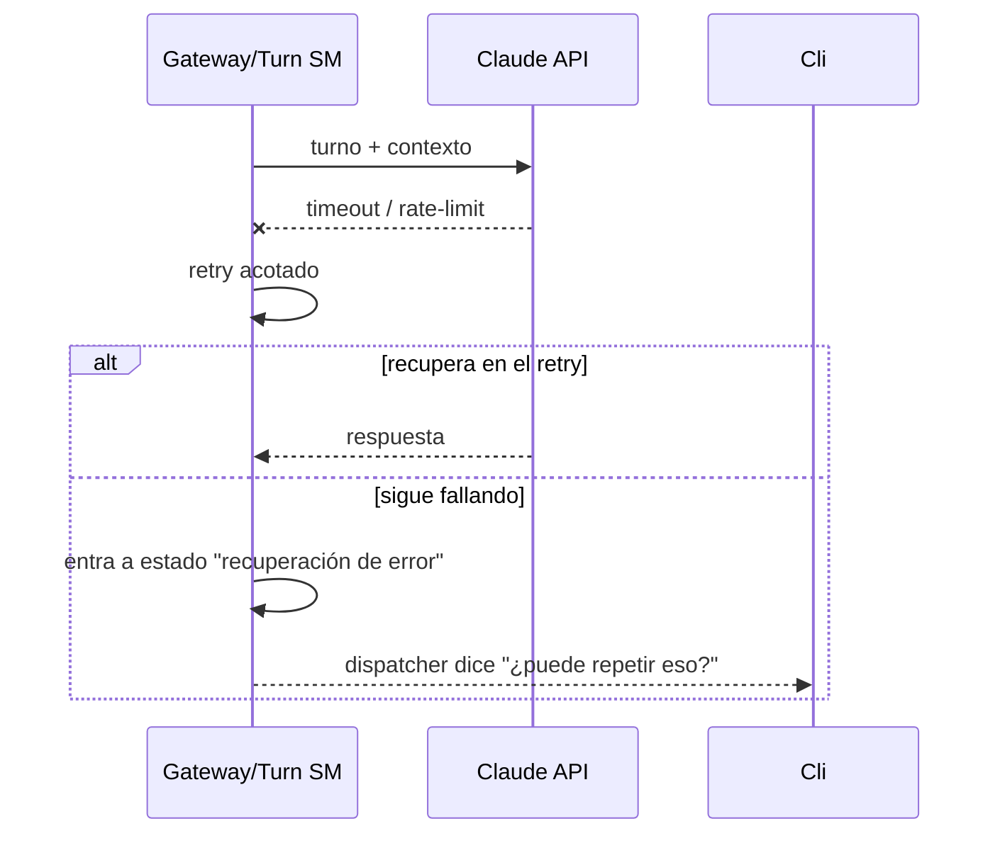
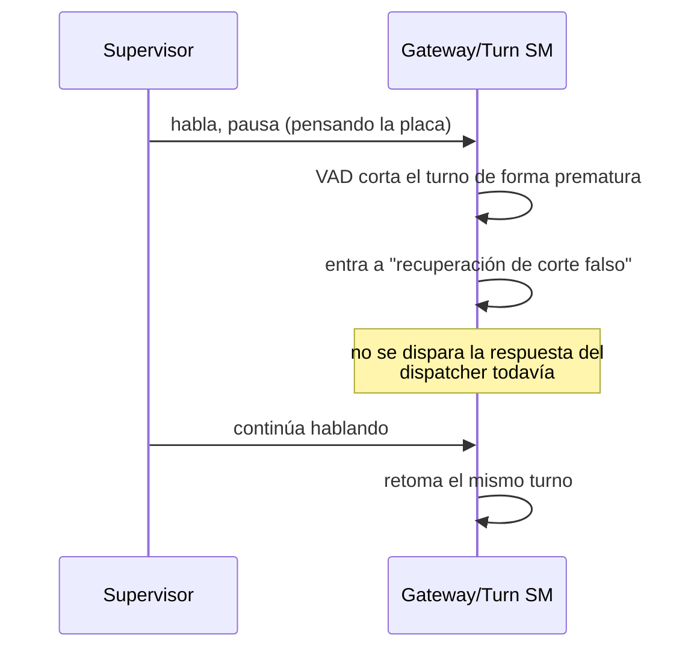
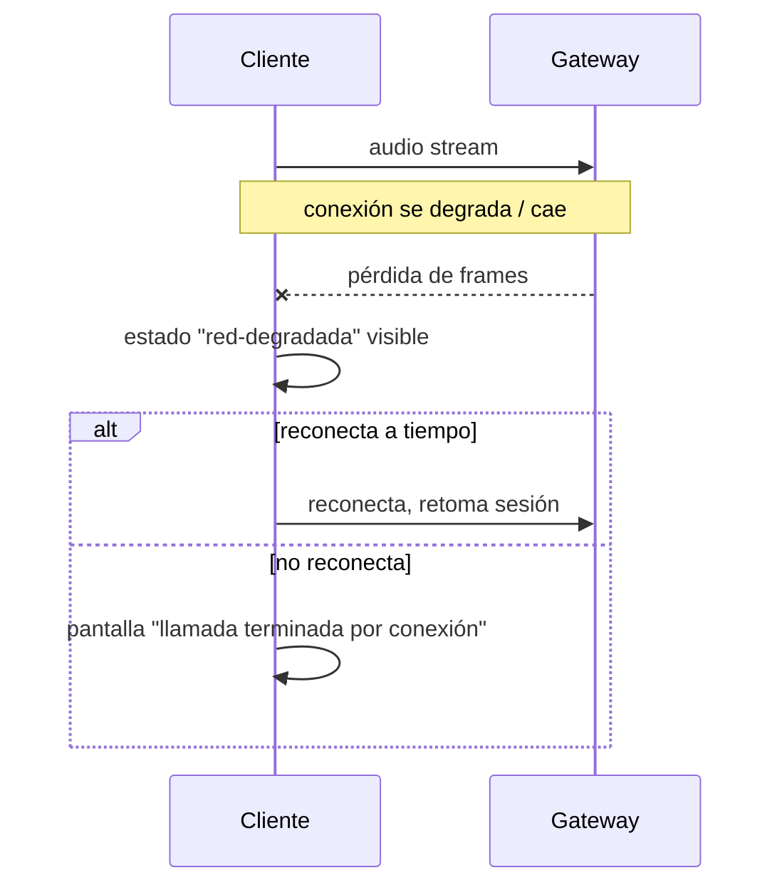
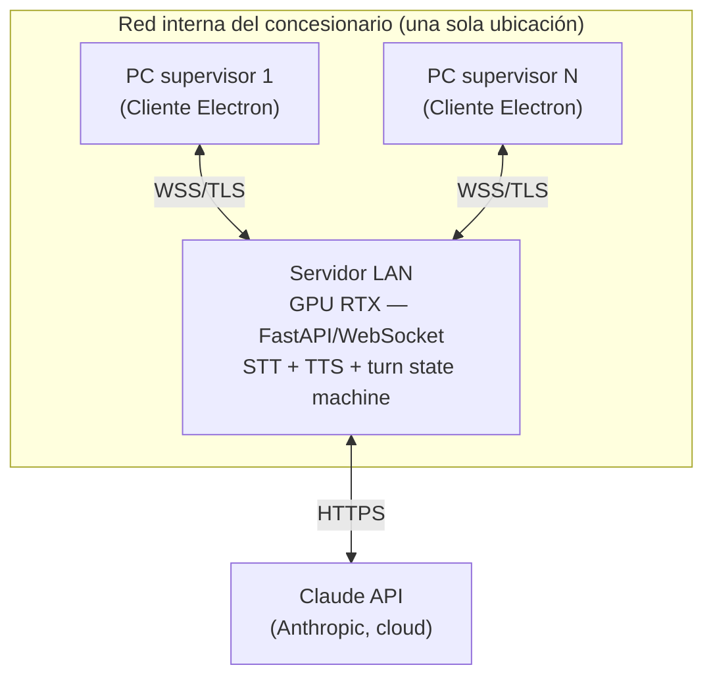

# arc42 — voice-agent

Archivo único (no 12 archivos separados) — proyecto de un solo equipo chico, se lee de corrido.
Cada sección enlaza a su fuente de verdad en vez de duplicar contenido; donde no hay fuente
todavía, queda marcado `[GAP — POR ESCRIBIR]` en vez de quedar en silencio.

---

## 1. Introducción y objetivos

Ver [`GOALS.md`](./GOALS.md) — fuente completa. Resumen: entrenar supervisores de
concesionario a reportar incidentes a la policía mediante llamadas de práctica en tiempo real
contra un dispatcher simulado por IA, auditadas después con métricas objetivas.

## 2. Restricciones de arquitectura

- Una sola ubicación/concesionario, 1 sesión concurrente (ver [NFR-11](./nfr.md#nfr-11)).
- El LLM siempre depende de conectividad a internet (Claude API) — ver
  [ADR-0003](./adr/0003-proveedor-llm-claude-api.md).
- Sin stack obligatorio impuesto por la empresa, salvo las decisiones ya tomadas en
  [ADR-0001](./adr/0001-lenguaje-backend-python.md) y
  [ADR-0002](./adr/0002-frontend-electron-react-tailwind.md).
- Sin restricción regulatoria de grabación de voz confirmada todavía (ver
  [TODO-05](./TODOS.md#todo-05)) — no asumir que no aplica ninguna.

## 3. Contexto del sistema

**Actores humanos:**

| Actor | Interacción |
|---|---|
| Supervisor (trainee) | Usa el cliente Electron para sostener una llamada de práctica y revisar su historial/métricas. |
| Jefe de área (sponsor) | No interactúa con el sistema en runtime; consume el resultado (supervisores mejor entrenados) y aprueba alcance/presupuesto. |
| IT / Seguridad | Administra el servidor LAN (dueño operativo, ver [TODO-03](./TODOS.md#todo-03)) y el mecanismo de auth. |
| Segundo ingeniero (a nombrar) | Mantiene y extiende el código — ver [TODO-06](./TODOS.md#todo-06). |

**Sistemas externos:**

| Sistema | Protocolo | Quién lo posee |
|---|---|---|
| Claude API (Anthropic) | HTTPS, API de mensajes | Anthropic — servicio externo, fuera del control del equipo. |

## 4. Estrategia de solución

Síntesis de los 6 ADRs vigentes:

- Backend en Python ([ADR-0001](./adr/0001-lenguaje-backend-python.md)), cliente Electron +
  React + Tailwind ([ADR-0002](./adr/0002-frontend-electron-react-tailwind.md)).
- LLM en la nube vía Claude API, nunca local ([ADR-0003](./adr/0003-proveedor-llm-claude-api.md)).
- Servidor centralizado en la LAN con GPU RTX, no un ejecutable por PC
  ([ADR-0004](./adr/0004-topologia-de-despliegue.md)).
- Detección automática de voz por turnos, sin interrupciones (barge-in) todavía
  ([ADR-0005](./adr/0005-audio-en-vivo-vad-sin-barge-in.md)).
- Backend organizado en hexagonal (puertos/adaptadores), sin el aparato táctico completo de DDD
  ([ADR-0006](./adr/0006-arquitectura-hexagonal.md)).

## 5. Vista de bloques de construcción

Los adaptadores STT/TTS/LLM ya existen como clases en el prototipo
(`WhisperSTT`, `KokoroTTS`, `ClaudeDispatcher`) — ver
[ADR-0006](./adr/0006-arquitectura-hexagonal.md) para qué sobrevive tal cual y qué se reescribe.

## 6. Vista de tiempo de ejecución

Cinco escenarios concretos — el camino feliz, el de manejo de error más delicado, el de mayor
duración, y los dos que cruzan más límites de componentes.

**6.1 — Camino feliz: un turno completo**

**6.2 — Error de Claude API a medio turno (ver [NFR-02](./nfr.md#nfr-02))**

**6.3 — Corte falso de VAD**

**6.4 — Caída de red LAN a medio turno**

**6.5 — Sesión completa, de mayor duración**

Encadena 6.1 N veces hasta que el supervisor termina o aborta la llamada, seguido de la
transición de decompresión y la generación del score (ver
[TODO-10](./TODOS.md#todo-10), fórmula pendiente).

## 7. Vista de despliegue

Concurrencia de diseño = 1 sesión a la vez ([NFR-11](./nfr.md#nfr-11)) — el diagrama muestra
múltiples PCs posibles, no sesiones simultáneas.

## 8. Conceptos transversales

- **Manejo de error**: ver [NFR-02](./nfr.md#nfr-02) — vive en los adaptadores, nunca en el
  dominio (regla de [ADR-0006](./adr/0006-arquitectura-hexagonal.md)).
- **Logging/observabilidad**: ver [NFR-08](./nfr.md#nfr-08).
- **Seguridad**: ver [NFR-04](./nfr.md#nfr-04), [NFR-05](./nfr.md#nfr-05).
- **Puertos y adaptadores**: regla no negociable en [CONTRIBUTING.md](../../CONTRIBUTING.md).

## 9. Decisiones de arquitectura

| ADR | Título | Estado |
|---|---|---|
| [0001](./adr/0001-lenguaje-backend-python.md) | Lenguaje/runtime del backend — Python | accepted |
| [0002](./adr/0002-frontend-electron-react-tailwind.md) | Frontend — Electron + React + Tailwind | accepted |
| [0003](./adr/0003-proveedor-llm-claude-api.md) | Proveedor de LLM — Claude API | accepted |
| [0004](./adr/0004-topologia-de-despliegue.md) | Topología de despliegue — servidor LAN + RTX | accepted — condicionado a spike (Gate 0) |
| [0005](./adr/0005-audio-en-vivo-vad-sin-barge-in.md) | Audio en vivo — VAD por turnos, sin barge-in | accepted |
| [0006](./adr/0006-arquitectura-hexagonal.md) | Estilo arquitectónico — hexagonal, sin DDD táctico | accepted |

## 10. Requisitos de calidad

Ver [`nfr.md`](./nfr.md) — fuente completa, 12 NFRs con ID estable. Los tres más críticos para
Fase 1: [NFR-01](./nfr.md#nfr-01) (latencia), [NFR-02](./nfr.md#nfr-02) (recuperación en
banda), [NFR-06](./nfr.md#nfr-06) (privacidad del historial).

## 11. Riesgos y deuda técnica

Ver [`TODOS.md`](./TODOS.md) — fuente completa, 14 ítems con ID estable. El mayor riesgo activo
hoy: [TODO-08](./TODOS.md#todo-08), del cual dependen directamente ADR-0004 y ADR-0005.

## 12. Glosario

Ver [`glossary.md`](./glossary.md) — fuente completa.
